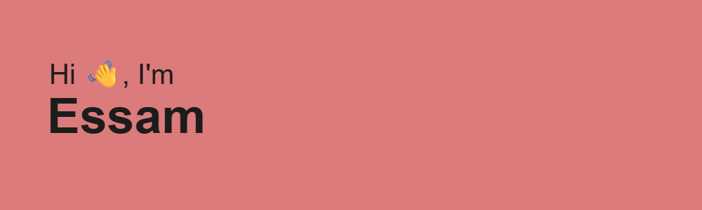

  

<h3 align="center">From Code to Pixel — Crafting Human-Centered Apps</h3>

  

---

### 🚀 About Me  
- 🔭 Currently building **[AI Waiter System](https://www.aivaserve.com/)** — AI-powered automation for restaurants.  
- 🌱 Exploring **AI systems & integrations**, focusing on practical, real-world use cases.  
- 👨‍💻 Check out all my projects here → [linktr.ee/elhamid.essam](https://linktr.ee/elhamid.essam)  
- 📫 Reach me at **elhamid.essam@gmail.com**  

---

### 🌐 Connect with Me  

  
  
  

---

### 🛠 Languages & Tools  

---

### 📊 GitHub Stats  

  

  

---

### 🏆 GitHub Achievements  

  

---

✨ *I’m passionate about creating seamless, human-centered digital experiences — from code to pixel.*  
